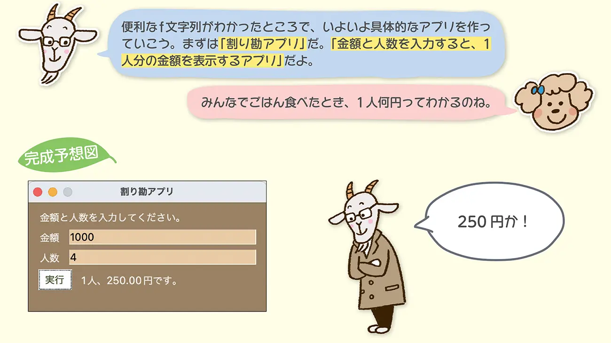

# 作るもののアイデアだし

## 基礎編

### 割り勘アプリ

#### 課題

- 「金額と人数を入力すると、1人分の金額を表示するアプリ」を作りましょう。

[答え合わせ](https://codezine.jp/article/detail/17031)

## データ収集編

### Webスクレイピング

- 分析データの取得をどこからかのページから取得できるようにする
  - わからないがたぶんfor文使いそう

[Webスクレイピング](https://udemy.benesse.co.jp/development/python-work/web-scraping.html)

### 法人情報

- csvを持ってこれるがAPIでデータ取得できそう
- データ欠損もありそうだから整形もやっていきたい

[法人情報](https://metidx-gov.note.jp/n/n940aa810ab83)

[WebAPI一覧](https://it-jog.com/wapi/webapis)

### データ前処理,欠損値の処理

## 教師あり学習

### モデルの選択と学習

### モデルの評価と調整

### テストデータを使った最終評価

### モデルの展開と予測

## 教師なし学習

### スケーリング: 

### データの分析:

### 次元削減: 

### 異常検知: 

### 関連ルールマイニング

### 結果の解釈と評価

### 次元削減結果の解釈

### 異常検知結果の評価

### 関連ルールマイニング結果の解釈: